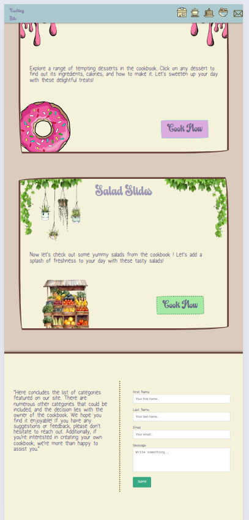
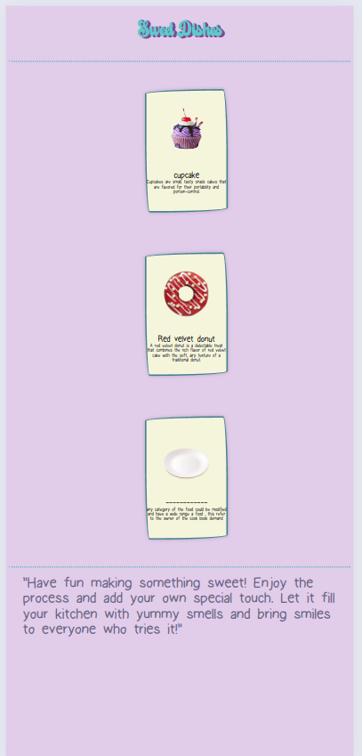
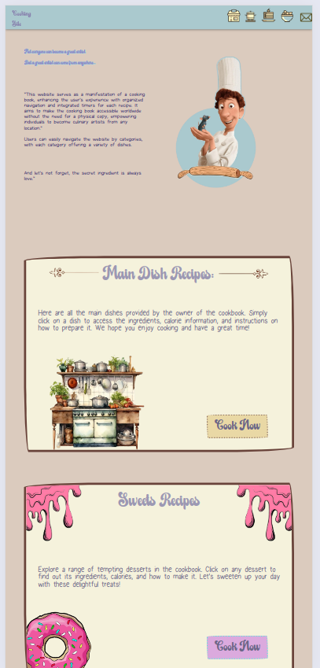

# Cooking Website

## Description
This project is a simple cooking website created using HTML and CSS. It features a clear layout for presenting various recipes. The initial design used very bright colors, which have been adjusted for a more refined visual appeal. The website is designed to be responsive and includes HTML, CSS, and image assets.

## Features
- **HTML Structure**: Organizes and displays recipe content.
- **CSS Styling**: Enhances the visual presentation and responsiveness.
- **Responsive Design**: The website adjusts seamlessly to different screen sizes.

## Getting Started
To view the website, you can download or clone the repository and open the `index.html` file in a web browser.
and make sure to download the fonts used to have a better vizualisation . 

### Prerequisites
- A modern web browser (e.g., Chrome, Firefox, Safari)

### Installation
1. Clone the repository: 
    ```bash
    git clone [repository-url]
    ```
2. Navigate to the project directory: 
    ```bash
    cd [project-directory]
    ```
3. Open `index.html` in your preferred web browser.

## Screenshots
Below are some images showcasing the responsive design of the website:





## Video
Watch the demonstration video to see the website in action and explore its features:

[Watch Video](cooking%20site%20-%20vid.mp4)
