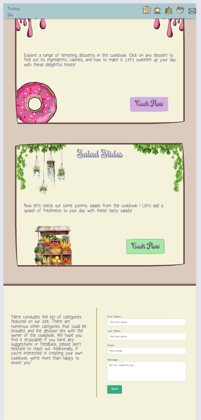
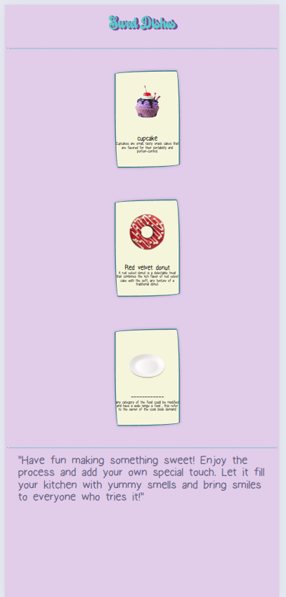
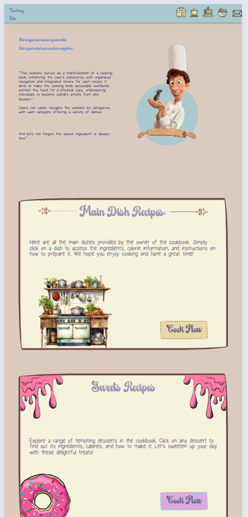

# Cooking Website

A static recipe website built as a first university web project, presenting dishes across three categories — main courses, desserts, and salads — with a warm handwritten aesthetic and a contact form.

## Features

- Home page with animated gif navigation icons linking to each recipe category
- Separate pages for main dishes, sweets, and salads, each with dish cards that scale on hover
- Custom Barbie Vintage and Handwriting fonts for a distinctive visual style
- Contact form at the bottom of the home page for visitor feedback
- Responsive card layout that stacks vertically on smaller screens

## Getting Started

```bash
git clone <repository-url>
```

Open `cook site/index.html` in any modern browser. For the fonts to render correctly, make sure the local font files inside `cook site/fonts/` are accessible (they load automatically when you open the file from the project folder).

## Project Structure

```
First_uni_web_project/
├── cook site/
│   ├── index.html          # Home page and entry point
│   ├── css/
│   │   └── project.css
│   ├── fonts/              # Barbie Vintage and Handwriting font files
│   ├── gifs/               # Animated nav icons (home, pot, cake, salad)
│   ├── images/             # Recipe and decorative images
│   └── html/
│       ├── main.html       # Main dishes page
│       ├── sweet.html      # Desserts page
│       └── salad.html      # Salads page
├── image1.png
├── image2.png
├── image3.png
└── cooking site - vid.mp4
```

## Screenshots





## Video

[Watch the site walkthrough](cooking%20site%20-%20vid.mp4)
